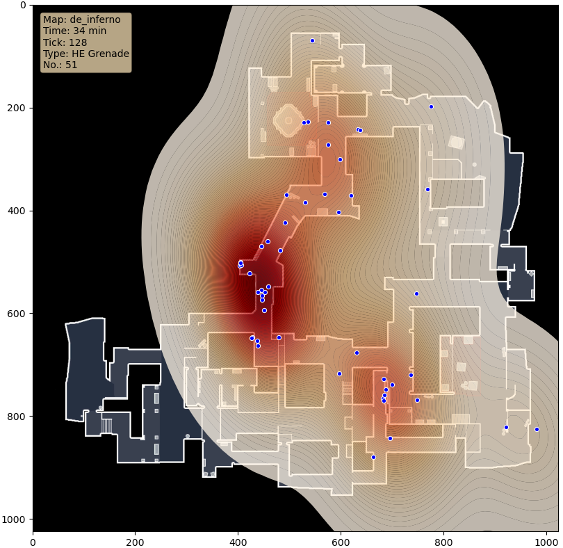

# UtilityMapper
*This project is currently under development. Stay tuned for updates.*
This project is focused around the mapping of utility usage from CS:GO demo files. Feel free to contribute!

## Current functionality
The program currently reads a `.dem` demofile from the directory `/demo` in the `demoData.js` file. This file listens and extracts predefined game events. In this case, it is whenever a HE grenade, flashbang or smoke is detonated. This event has multiple attributes. For now, the code only extracts `x`, `y`, and `z` coordinates from which the grenade was detonated. These coordinates are then sequentially pushed into an array, and exported to a `json` file in the `/data` folder.

The exported `json` file is then read by the `main.py` file. This file reads the nested json file and appends the data into separate arrays containing the `x` and `y` coordinates. These two arrays values are then converted into values that can be mapped onto a 1024px x 1024px wide image of the map of which the data originates. The converted values are finally read by `seaborn`, which maps the image with dots representing the coordinates in which the grenades were detonated. The final result is exported to a `.png` image in the `/export` folder.

The final image will look similar to this:

## How to use
In order to use this project, you need the following packages:
- npm
	- [demofile](https://www.npmjs.com/package/demofile)
- pip
	- [matplotlib](https://pypi.org/project/matplotlib/)
    - [seaborn](https://pypi.org/project/seaborn/)

#### Step 1:
Insert your demo file into the `/demo` folder. Rename your file to `test.dem`.
*You can also use the included demo file to test the functionality.*

#### Step 2:
Execute the `demoData.js` file. This will run for several seconds before finishing.
This file will extract the grenade data from the demo.

#### Step 3:
Execute the `main.py` file and follow the instructions in the terminal.
Your exported image will be exported to the `/export` folder.

### Planned features:
- Heatmap generator of utility usage
	- Grenade damage
	- Grenade hits
    - Effective flashes

### Checklist
-  [x] Demo data extraction using [demofile](https://github.com/saul/demofile)
	- [x] Grenade coordinates
	- [ ] HE grenade damage
	- [ ] Time flashbanged
-  [x] JSON parsing from JS
-  [x] JSON data extraction in Python
-  [x] Image export
- [x] Multi map support
	- [x] de_inferno
	- [x] de_dust2
	- [x] de_train
	- [x] de_mirage
	- [x] de_overpass
	- [x] de_cache
- [ ] Multi grenade type support
	- [x] HE Grenade
	- [x] Flashbang
	- [x] Smoke
	- [ ] Molotov/Fire
- [ ] Grenade damage mapping

### Special thanks
Thank you to Bill Freeman for providing the values for converting global coordinates to the range of the image resolution. See his project [here](https://www.kaggle.com/billfreeman44/finding-classic-smokes-by-t-side-on-mirage).